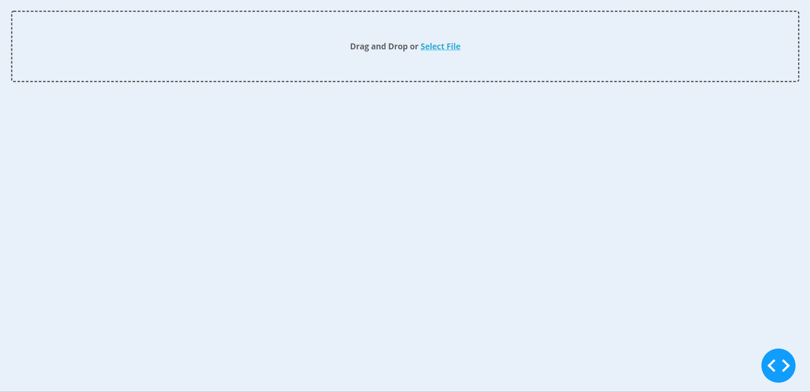

### Dash webapp for power analysis
Simple self-hosting web app for interactively analyzing power files.

Upload your power data from TCX files or CSV files and calculate power averages

The app is written in Python and leverages [Dash](https://plot.ly/products/dash/), a framework which wraps React and the Plot.ly graphing library.

The app includes an XML parser to convert TCX to CSV.
CSV with six fields (`Lap,Time,Distance,HeartRate,Cadence,Power`) is accepted (check in examples directory for a sample CSV schema).
